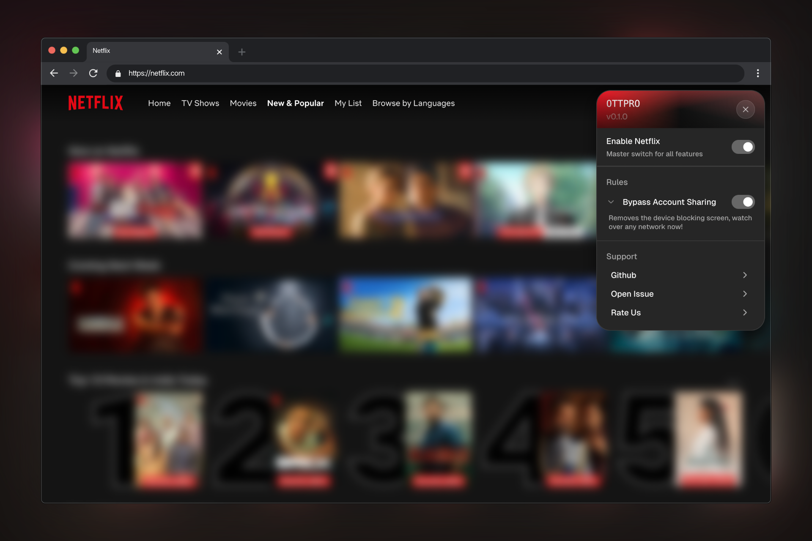

# OTTPRO Browser Extension

### <u>Your force field against OTT restrictions - Binge with freedom!</u>

This extension provides patches for various OTT apps like Netflix, Hulu and many more. Go to the respective OTT website and click on the extension icon from tool bar to explore the list of available patches. By default all patches are applied 🎉

### 📥 Installation on Chromium browsers (Chrome, Edge, Brave, others)

### 📥 Installation on Firefox Browser

## ✨ Features

1. **Netflix**
   - Bypass household device blocking - Netflix blocks the page by a verification wall which asks you to enter a temporary code valid for 14 days. You can use others account from any location and with this patch you can bypass that wall.
  
2. **Coming Soon** 

## 🤝 Contributing
Contributions to this repo and welcome! Please feel free to raise issues, submit pull requests or discuss.

> [!WARNING]  
This extension may violate the OTT Platform's terms of usage. We are not responsible for any actions, please use at your own risk.
