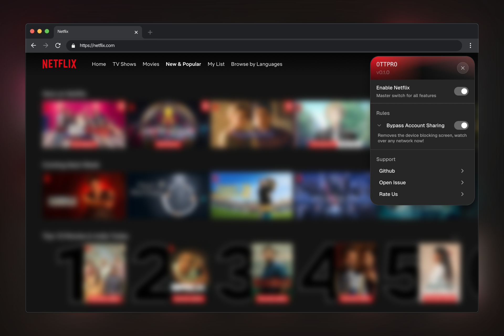
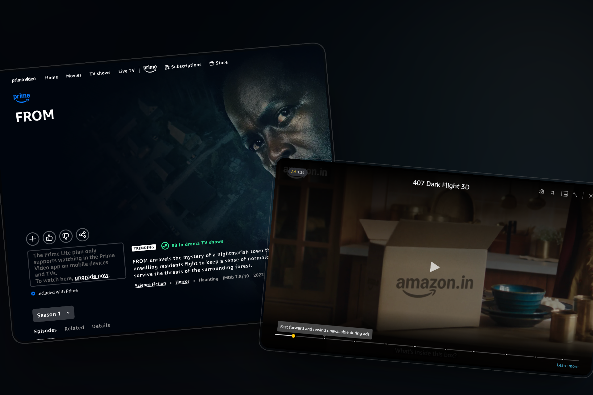
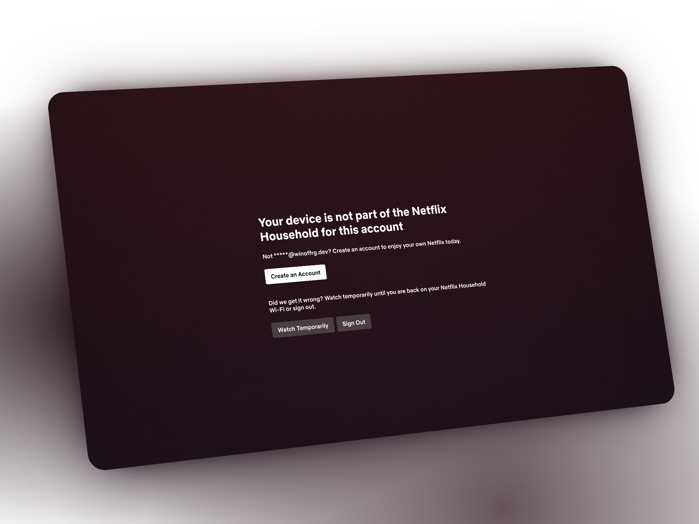
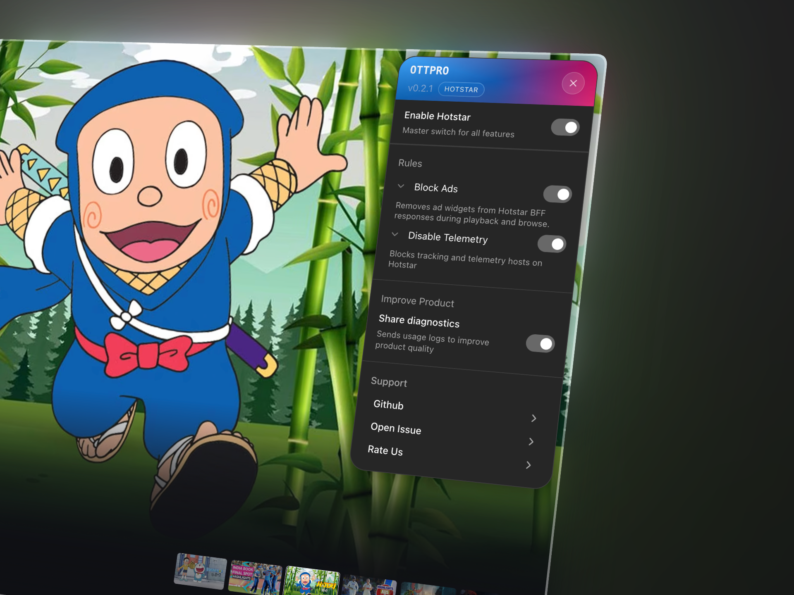

# OTTPRO Browser Extension

  
   

### <u>Your force field against OTT restrictions - Binge with freedom!</u>

This extension provides patches for various OTT apps like Netflix, Prime Video, Hotstar and many more. Go to the respective OTT website and click on the extension icon from tool bar to explore the list of available patches. By default all patches are applied 🎉

### 📥 Installation on Chromium browsers (Chrome, Edge, Brave, others)

### 📥 Installation on Firefox Browser

## ✨ Features

1. **Netflix**
   

   
Bypass Device Blocking Access Netflix on multiple without Geo Blocking or Email Verification.

   
   

   

   
Enable PiP Mode - Clears Netflix PiP restriction on supported pages.

   &nbsp;

   https://github.com/user-attachments/assets/14d0bde7-b684-4288-945d-4dcd84690300
   

2. **Prime Video**
   

   
Bypass Lite Plan - Enables better playback behavior for Lite plans on desktop.

   &nbsp;

   https://github.com/user-attachments/assets/9051f415-0b7b-4ca1-b928-b2436d173215
   

   

   
Block Ads - Blocks ad requests during playback.

   &nbsp;

   https://github.com/user-attachments/assets/3f4bdf28-41ad-4358-8156-666f0304513e
   

   

   
Block Telemetry - Blocks tracking and analytics requests.

   &nbsp;

   https://github.com/user-attachments/assets/2689278d-cc34-4458-bade-27090124d077
   

3. **Hotstar**
   

   
Block Ads - Removes ad widgets and ad payload keys from BFF API responses.

   
   

   

   
Disable Telemetry - Blocks telemetry and tracking endpoints on Hotstar.

   
   

## 🤝 Contributing
Contributions to this repo and welcome! Please feel free to raise issues, submit pull requests or discuss.

> [!WARNING]  
This extension may violate the OTT Platform's terms of usage. We are not responsible for any actions, please use at your own risk.
